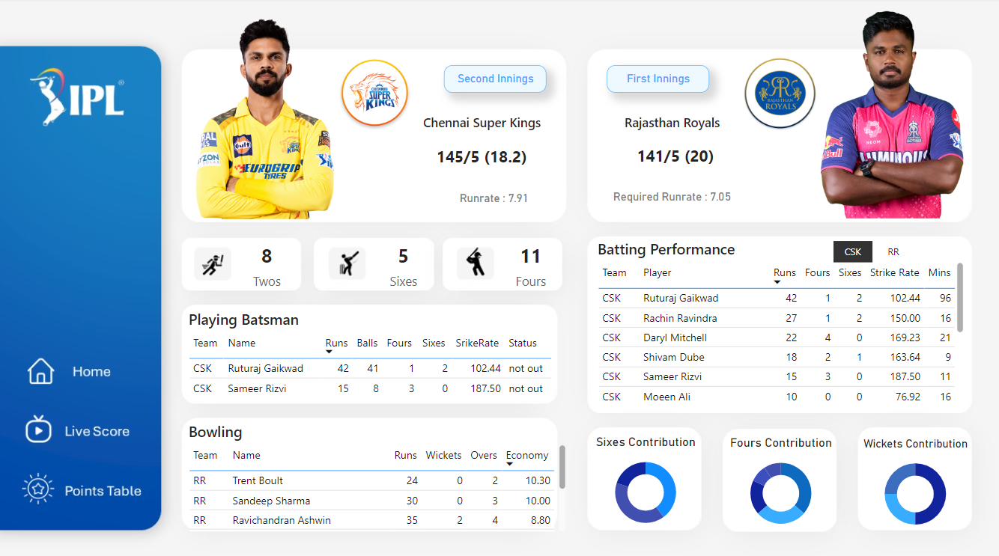
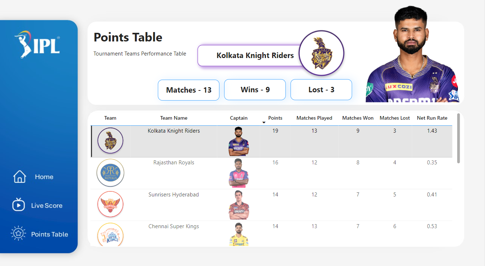
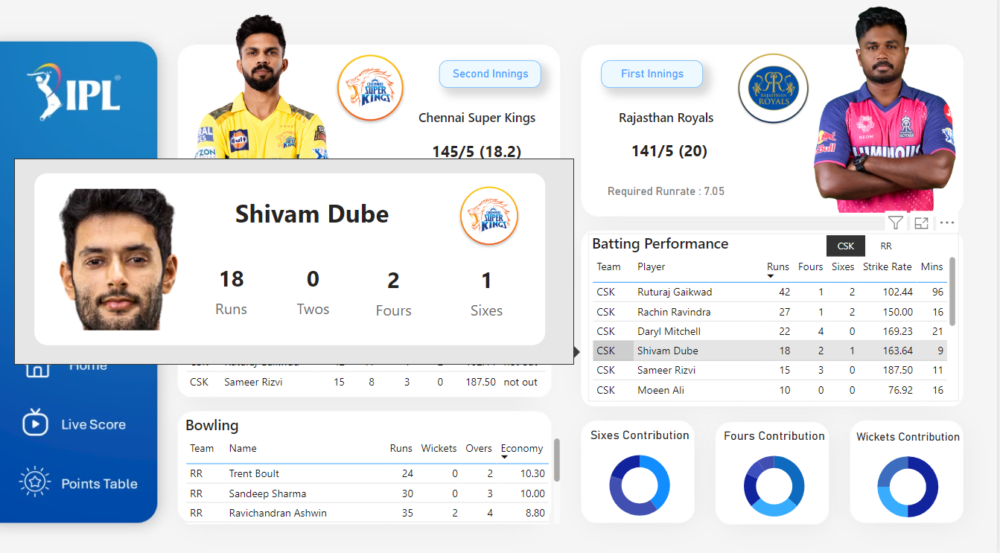

# IPL Dashboard
------

This repository hosts the source code for an interactive IPL (Indian Premier League) Dashboard built using PowerBI. The dashboard provides real-time updates on ongoing matches, including live scores, batting and bowling statistics for both teams, and the points table. 

## Overview
The IPL Dashboard offers cricket enthusiasts a comprehensive view of the tournament's progress, leveraging data from the Cricbuzz Cricket API to provide up-to-date information on match performances and team standings.

## Technologies Used ⚙
- PowerBI

## Features ✨
- **Live Match Scores:** Real-time updates on ongoing IPL matches.
- **Batting and Bowling Statistics:** Detailed statistics for each team, including batting and bowling performances.
- **Points Table:** Current standings of all teams in the tournament.

## Data Sources
- **Cricbuzz Cricket API:** Provides live cricket scores, player statistics, and other cricket-related data.

## Screenshots 📸

## Contributing
Contributions are welcome! If you have ideas for improvements or new features, feel free to open an issue or submit a pull request.

## License
This project is licensed under the [MIT License](LICENSE).

## Feedback
Your feedback is valuable! If you have any questions, suggestions, or encounter any issues, please feel free to reach out.
